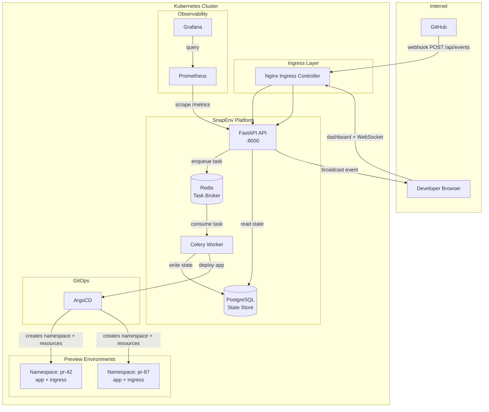
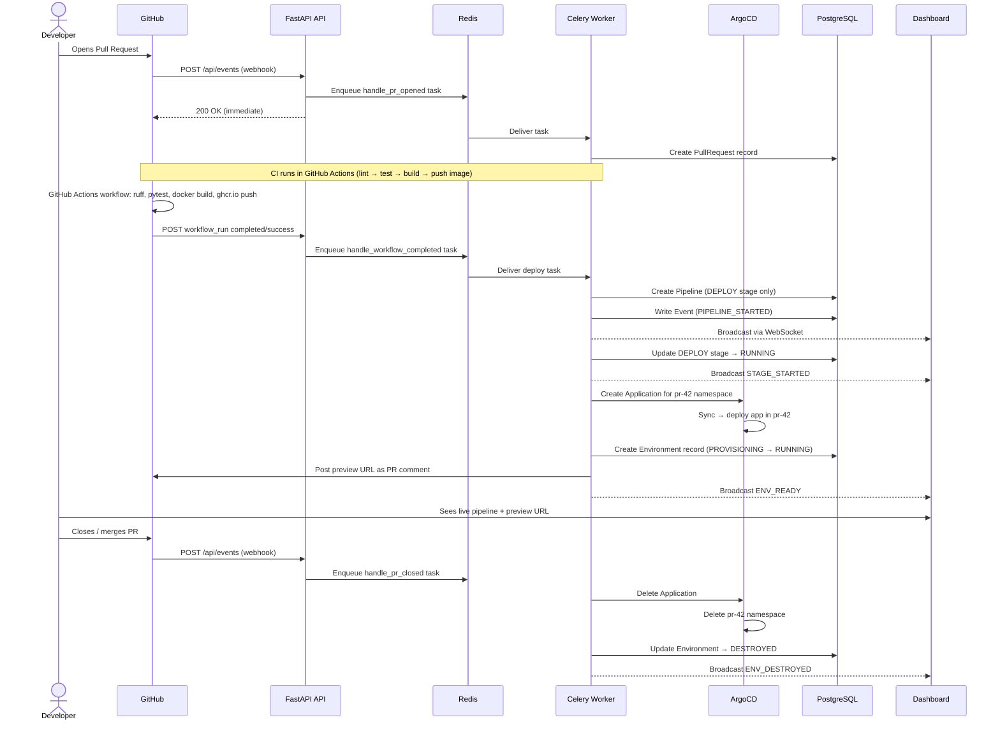
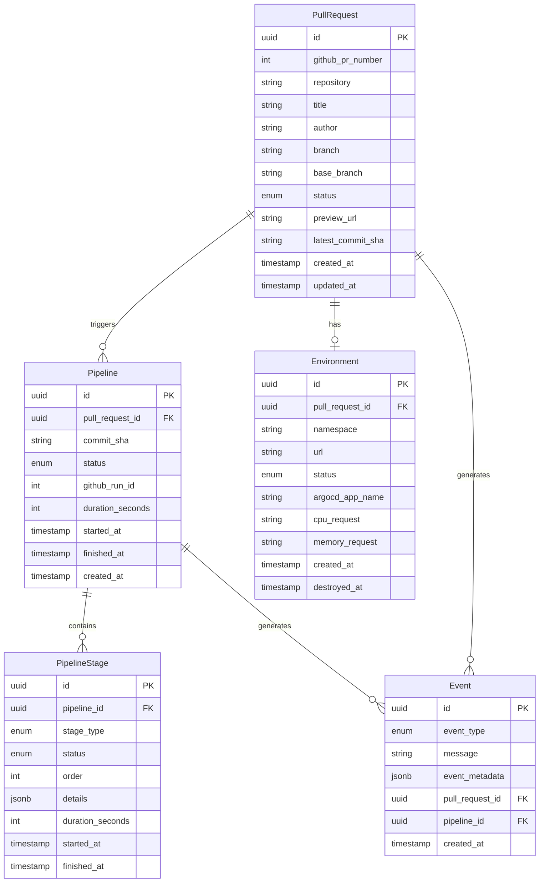
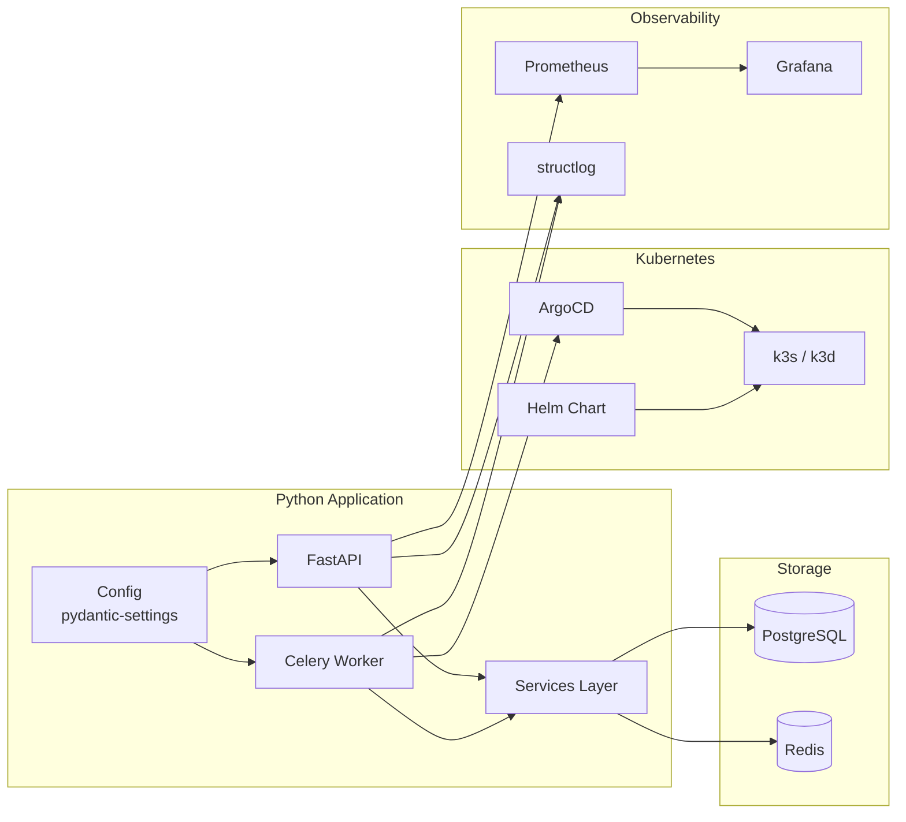

# SnapEnv

A self-hosted platform that automatically creates ephemeral **preview environments** for every Pull Request — with a full CI pipeline, quality gates, real-time dashboard, and GitOps-based deployment.

[](https://github.com/robin-replat/snapenv/actions/workflows/ci.yml)
[](https://www.python.org/downloads/)
[](https://github.com/astral-sh/ruff)

> [!IMPORTANT]
> **Project status: prototype.** The API and dashboard work, but the full PR-to-preview
> path is not production-ready yet: image build/push, post-CI deployment, ArgoCD health
> reconciliation, secrets and orphan cleanup remain to be implemented. See the
> [complete audit](docs/AUDIT_2026-06-29.md).

---

## What is SnapEnv?

When a developer opens a Pull Request, SnapEnv:

1. Receives a GitHub webhook
2. Lets GitHub Actions run the CI pipeline (lint → test → build image → push to registry)
3. Creates an isolated Kubernetes namespace and deploys the PR image via ArgoCD
4. Posts the preview URL to the PR as a comment
5. Streams all events in real time to a dashboard
6. Tears everything down when the PR is closed or merged

Every PR gets its own environment. No shared staging. No "who broke staging?" conversations.

---

## Architecture



---

## PR Lifecycle — Sequence Diagram



---

## Data Model



---

## Technology Stack

### Why each technology was chosen

| Layer | Technology | Why |
|---|---|---|
| **API** | FastAPI | Native async/await, automatic OpenAPI docs, WebSocket support, fastest Python framework for I/O-bound workloads |
| **Task Queue** | Celery + Redis | Webhook handler must return in < 3s (GitHub timeout). Pipeline stages take minutes. Celery decouples reception from execution with persistence and automatic retry |
| **Database** | PostgreSQL | Relational integrity for PR → Pipeline → Stage hierarchy. JSONB for flexible stage details without schema changes |
| **ORM** | SQLAlchemy async + asyncpg | Non-blocking DB queries inside async FastAPI handlers. Alembic for versioned schema migrations |
| **Container runtime** | Docker | Standard image format, used by both k3d (local) and k3s (production) |
| **Local K8s** | k3d | Kubernetes running inside Docker containers — full K8s API on a laptop without a VM. Disposable clusters in seconds |
| **Production K8s** | k3s | Lightweight Kubernetes (< 100 MB binary) optimised for ARM and single-node setups — matches the OCI free-tier ARM VM perfectly |
| **Package manager (K8s)** | Helm | Templated YAML + values overrides per environment. `helm upgrade --install` is idempotent |
| **GitOps** | ArgoCD | Declarative preview environment management. ArgoCD creates/deletes namespaces and keeps them in sync with Git. No imperative kubectl scripts |
| **Ingress** | nginx ingress | Battle-tested, supports host-based routing, used by kube-prometheus-stack natively. No need for Gateway API at this scale |
| **Monitoring** | Prometheus + Grafana | Industry standard. kube-prometheus-stack auto-discovers ServiceMonitors. FastAPI exposes `/metrics` via `prometheus-fastapi-instrumentator` |
| **Structured logging** | structlog | JSON logs with consistent fields (event, pr_id, duration). Parseable by Grafana/Loki without regex |
| **Infrastructure** | Terraform + OCI | Provisions the Oracle Cloud ARM VM (always-free tier: 4 OCPUs / 24 GB RAM). Terraform manages the VM lifecycle declaratively |
| **Configuration** | Ansible | Bridges Terraform (VM created) and K8s (cluster ready). Installs k3s, Helm, nginx, Prometheus, ArgoCD idempotently via playbook |
| **Python tooling** | uv + Ruff | uv replaces pip/poetry with 10-100× faster installs. Ruff replaces flake8 + isort + black in one tool |
| **Testing** | pytest + testcontainers | Testcontainers spins up a real PostgreSQL in Docker for integration tests — no mocks, no drift between test and production behaviour |
| **CI** | GitHub Actions | Lint → Security → Test → Build pipeline. Gitleaks for secret scanning, Bandit for SAST |

---

## Repository Structure

```
SnapEnv/
├── src/
│   ├── api/
│   │   ├── routes/          # FastAPI route handlers (read-only endpoints)
│   │   │   ├── pull_requests.py
│   │   │   ├── pipelines.py
│   │   │   ├── events.py
│   │   │   ├── dashboard.py
│   │   │   └── websocket.py
│   │   ├── middleware/      # Custom middleware (request logging, auth — future)
│   │   └── static/          # Dashboard HTML + CSS
│   ├── models/
│   │   ├── entities.py      # SQLAlchemy ORM models (PullRequest, Pipeline…)
│   │   ├── database.py      # Engine, session factory, get_db() dependency
│   │   └── config.py        # Pydantic-settings (env vars → typed config)
│   ├── schemas/
│   │   └── api.py           # Pydantic response/request schemas
│   ├── services/            # Business logic — called by both routes and workers
│   │   ├── event_service.py     # Write events + broadcast to WebSocket
│   │   ├── pipeline_service.py  # Create/advance pipeline and stage state
│   │   └── environment_service.py # Create/update/destroy environments
│   └── workers/
│       ├── celery_app.py    # Celery instance (broker=Redis)
│       └── tasks.py         # Task definitions (handle_pr_opened, …)
├── alembic/                 # Database migrations
│   └── versions/
├── infra/
│   ├── helm/snapenv/        # Helm chart — deploys the platform itself
│   │   ├── templates/
│   │   │   ├── deployment.yaml      # FastAPI API
│   │   │   ├── worker.yaml          # Celery worker
│   │   │   ├── redis.yaml           # Redis broker
│   │   │   ├── postgresql.yaml      # PostgreSQL StatefulSet
│   │   │   ├── ingress.yaml         # snapenv.localhost / snapenv.{ip}.nip.io
│   │   │   ├── grafana-ingress.yaml # grafana.{ip}.nip.io
│   │   │   ├── servicemonitor.yaml  # Prometheus scrape config
│   │   │   ├── grafana-dashboard.yaml # Auto-loaded Grafana dashboard
│   │   │   └── secret.yaml          # DB credentials secret
│   │   ├── values.yaml       # Default values
│   │   └── values-local.yaml # Generated from .env (gitignored)
│   ├── terraform/           # Provisions OCI ARM VM
│   └── ansible/             # Configures VM (k3s, Helm, ArgoCD…)
├── tests/
├── .docker/
│   └── Dockerfile.api       # Multi-stage build (builder + runtime)
├── scripts/
│   ├── setup-cluster.sh     # Local k3d cluster bootstrap
│   └── init-db.sh           # Creates snapenv_test DB on first start
├── .github/workflows/
│   └── ci.yml               # Lint → Security → Test → Build
└── Makefile                 # All development commands
```

---

## Getting Started — Local Development (k3d)

### Prerequisites

| Tool | Purpose | Install |
|---|---|---|
| Docker | Container runtime | [docs.docker.com](https://docs.docker.com/get-docker/) |
| k3d | Local Kubernetes | `brew install k3d` |
| kubectl | K8s CLI | `brew install kubectl` |
| Helm | K8s package manager | `brew install helm` |
| uv | Python package manager | `curl -LsSf https://astral.sh/uv/install.sh \| sh` |

### Step 1 — Configure credentials

```bash
cp .env.example .env
# Edit .env and set POSTGRES_USER, POSTGRES_PASSWORD, POSTGRES_DB
```

### Step 2 — Create the local cluster

```bash
make cluster-create
# Creates a k3d cluster with:
# - Nginx Ingress Controller
# - kube-prometheus-stack (Prometheus + Grafana)
# - ArgoCD (accessible at http://argocd.localhost)
```

### Step 3 — Generate Helm secrets from .env

```bash
make helm-secrets
# Writes infra/helm/snapenv/values-local.yaml with your DB credentials
```

### Step 4 — Deploy the application

```bash
make k8s-deploy
# Builds Docker image → imports into k3d → helm upgrade --install
```

### Step 5 — Run database migrations

```bash
# Port-forward PostgreSQL temporarily
kubectl port-forward svc/snapenv-postgresql 5432:5432 &
make migrate
```

### Verify everything is running

```bash
make k8s-status
# Expected output: api, worker, postgresql, redis pods all Running

curl http://snapenv.localhost/health
# → {"status": "healthy"}

curl http://snapenv.localhost/docs
# → Swagger UI
```

### Access the UIs

| Service | URL | Credentials |
|---|---|---|
| SnapEnv Dashboard | http://snapenv.localhost | — |
| Swagger / OpenAPI | http://snapenv.localhost/docs | — |
| Grafana | http://grafana.localhost | admin / admin |
| ArgoCD | http://argocd.localhost | `make argocd-ui` prints password |

### Real GitHub events with a local k3d cluster

This is the recommended mode when you do not have a cloud Kubernetes cluster yet:
GitHub remains the source of webhooks and CI, while SnapEnv and every preview run
inside your local k3d cluster.

```bash
# 1. Expose local ingress to GitHub.
ngrok http 80 --host-header=snapenv.localhost

# 2. Use the generated HTTPS URL as the GitHub webhook Payload URL:
# https://xxxx.ngrok-free.app/api/webhooks/github
```

Configure the GitHub webhook with:

- Content type: `application/json`
- Secret: same value as `GITHUB_WEBHOOK_SECRET`
- Events: Pull requests and Workflow runs

The CI workflow publishes a multi-arch image to GHCR, so local k3d on amd64 and
ARM64 nodes can pull the same PR tag. If the GHCR package is private, set
`GHCR_USERNAME` and `GHCR_TOKEN` in `.env`, then run `make helm-secrets` and
`make k8s-deploy` again so preview namespaces receive an image pull secret.

For real preview creation, `ARGOCD_TOKEN` must be set. The local cluster setup creates
a dedicated `snapenv-worker` ArgoCD API account for this token. Without it, the worker
fails the deployment instead of marking a preview as ready without creating it.

---

## Deploying to Production (Oracle Cloud ARM)

SnapEnv runs for free on Oracle Cloud's Always Free tier:
**4 ARM OCPUs · 24 GB RAM · 200 GB storage** — plenty for a production preview platform.

### Step 1 — Provision the VM with Terraform

```bash
cd infra/terraform
cp terraform.tfvars.example terraform.tfvars
# Fill in your OCI credentials
terraform init
terraform apply
# → Outputs the server public IP
```

### Step 2 — Configure the server with Ansible

```bash
make provision
# Reads server IP from terraform output automatically, then:
# - Updates OS packages
# - Installs Docker + k3s (--disable=traefik)
# - Installs Helm, nginx ingress, kube-prometheus-stack, ArgoCD
# - Configures HTTP ingress for Grafana and ArgoCD via nip.io
```

### Step 3 — Deploy the application

```bash
# Fetch the remote kubeconfig
scp opc@$(cd infra/terraform && terraform output -raw server_public_ip):~/.kube/config ~/.kube/snapenv-remote.yaml
export KUBECONFIG=~/.kube/snapenv-remote.yaml

make helm-secrets
make k8s-deploy
```

### Access the remote UIs

All URLs use [nip.io](https://nip.io) — no DNS configuration needed.

```
http://snapenv.<server-ip>.nip.io      ← Dashboard
http://grafana.<server-ip>.nip.io      ← Grafana  (admin / admin)
http://argocd.<server-ip>.nip.io       ← ArgoCD
```

---

## Component Interaction Map



---

## Development Commands

```bash
# Quality
make fmt          # Format code (ruff fix + ruff format)
make lint         # Ruff + mypy type checking
make security     # Gitleaks + Bandit SAST
make test         # pytest with coverage
make check        # All of the above in order

# Kubernetes (local)
make cluster-create   # Bootstrap k3d cluster
make cluster-delete   # Tear down k3d cluster
make k8s-build        # Build Docker image and import into k3d
make k8s-deploy       # Build + deploy via Helm
make k8s-status       # Show pods, services, ingresses
make k8s-logs         # Tail API pod logs
make helm-secrets     # Generate values-local.yaml from .env

# Production
make provision        # Run Ansible playbook against OCI server

# Database
make migrate          # alembic upgrade head
make migration msg="add indexes"  # Create new migration

# UIs
make argocd-ui        # Print ArgoCD URL + password
make grafana-ui       # Print Grafana URL
```

---

## API Reference

| Method | Path | Description |
|---|---|---|
| `GET` | `/health` | Health check (used by K8s probes) |
| `GET` | `/metrics` | Prometheus metrics |
| `GET` | `/api/pull-requests` | List PRs (filter by status, paginate) |
| `GET` | `/api/pull-requests/{id}` | PR detail with environment + pipeline history |
| `GET` | `/api/pipelines/{id}` | Pipeline detail with all stage results |
| `GET` | `/api/events` | Recent events (filter by PR) |
| `GET` | `/api/stats` | Dashboard aggregate metrics |
| `POST` | `/api/webhooks/github` | GitHub webhook receiver (PR events) |
| `WS` | `/api/events/ws` | Real-time event stream (WebSocket) |
| `GET` | `/docs` | Swagger UI |

---

## End-to-End Workflow — Testing a Real Pull Request

This section walks through the full cycle: from pushing code, through the webhook, through the Celery worker, to seeing the event on the dashboard.

### Overview

```
GitHub PR opened
       │
       ▼
POST /api/webhooks/github   ← nginx ingress → FastAPI
       │  HMAC-SHA256 validated
       │  handle_pr_opened → register PR only
       ▼
GitHub Actions              ← lint, security, tests, multi-arch image push
       │
       │  workflow_run: completed + success
       ▼
POST /api/webhooks/github
       │  handle_workflow_completed.delay(payload)
       ▼
Celery Worker               ← deploys the exact successful commit
       │  creates DB records, runs pipeline stages
       │  broadcasts events via WebSocket
       ▼
Dashboard updates in real time
```

---

### Step 1 — Configure the GitHub Webhook

Go to your repository on GitHub:

```
Settings → Webhooks → Add webhook
  Payload URL:  https://xxxx.ngrok-free.app/api/webhooks/github
                (or https://snapenv.<server-ip>.nip.io/api/webhooks/github for a remote cluster)
  Content type: application/json
  Secret:       <same value as GITHUB_WEBHOOK_SECRET in your .env>
  Events:       ✓ Pull requests
                ✓ Workflow runs
```

Set the same secret in `.env`:

```bash
GITHUB_WEBHOOK_SECRET=your-secret-here
```

Then redeploy so the API picks it up:

```bash
make k8s-deploy
```

> **Local k3d needs a public webhook URL.** Use [ngrok](https://ngrok.com/) to expose your local cluster:
> ```bash
> ngrok http 80 --host-header=snapenv.localhost
> # Use the https://xxxx.ngrok-free.app URL as the GitHub webhook Payload URL
> ```

---

### Step 2 — Open (or reopen) a Pull Request

Push a branch and open a PR against your repo. Within seconds:

1. GitHub sends `POST /api/webhooks/github` with `X-GitHub-Event: pull_request` and `action: opened`
2. The API validates the HMAC-SHA256 signature and enqueues `handle_pr_opened`
3. GitHub receives `200 OK` in < 1 second

Verify the webhook was received:

```bash
# Check GitHub delivered it (green tick = 200 OK)
# GitHub → Settings → Webhooks → Recent Deliveries

# Check the API pod accepted it
make k8s-logs
# Look for: webhook_received event=pull_request action=opened pr=42
#            task_enqueued  task=handle_pr_opened pr=42
```

---

### Step 3 — Watch Registration, CI, and Deployment

```bash
# Tail worker logs
kubectl logs -n snapenv -l app=snapenv-worker -f

# Expected output:
# Task handle_pr_opened[<uuid>] received
# handle_pr_opened | PR #42 | repo=owner/repo | branch=feature/foo | sha=abc123
# handle_pr_opened completed | PR #42
# ... GitHub Actions completes and pushes the multi-arch image ...
# Task handle_workflow_completed[<uuid>] received
# deploy_ci_revision | PR #42 | repo=owner/repo | sha=abc123
```

---

### Step 4 — Verify the Dashboard

Open `http://snapenv.localhost` (or `http://snapenv.<ip>.nip.io`).

The dashboard connects via WebSocket to `/api/events/ws`. Every event written to the database is broadcast to all connected browsers in real time.

You can also query the API directly:

```bash
# List PRs
curl http://snapenv.localhost/api/pull-requests | jq .

# List recent events
curl http://snapenv.localhost/api/events | jq .

# Dashboard stats
curl http://snapenv.localhost/api/stats | jq .
```

---

### Step 5 — Close or Merge the PR

When you close or merge the PR:

1. GitHub sends `action: closed`
2. The API enqueues `handle_pr_closed`
3. The worker tears down the preview environment (namespace deleted via ArgoCD)
4. The dashboard broadcasts `ENV_DESTROYED`

---

### Troubleshooting Checklist

| Symptom | Where to look | Fix |
|---|---|---|
| GitHub webhook returns 401 | API logs | `GITHUB_WEBHOOK_SECRET` mismatch — check both GitHub and `.env` |
| GitHub webhook returns 422 | API logs | Malformed JSON — GitHub bug, usually retries itself |
| Task never appears in worker | Worker logs | Check Redis is reachable: `kubectl exec -it svc/snapenv-redis -- redis-cli ping` |
| Worker pod CrashLoopBackOff | `kubectl describe pod` | Missing env var — check `REDIS_HOST`, `POSTGRES_*` in the secret |
| Dashboard shows no events | Browser console | WebSocket `ws://snapenv.localhost/api/events/ws` blocked? Check ingress for `/api/events/` path |
| Pod image not updated | `kubectl get pod` | Run `make k8s-build` before `make k8s-deploy` to rebuild and reimport the image |

---

## CI Pipeline

Every push and pull request runs:

```
┌─────────┐   ┌──────────┐
│  Lint   │   │ Security │   ← Parallel (Stage 1)
│ ruff    │   │ gitleaks │
│ mypy    │   │ bandit   │
└────┬────┘   └────┬─────┘
     └──────┬───────┘
            │
       ┌────▼────┐
       │  Tests  │            ← Stage 2 (needs both above)
       │ pytest  │
       │ testcontainers       │
       └────┬────┘
            │
    ┌───────▼────────┐
    │  Build (PR only)│       ← Stage 3
    │  docker build  │
    │  trivy scan    │
    │  syft SBOM     │
    └────────────────┘
```

---

## Environment Variables

| Variable | Default | Description |
|---|---|---|
| `POSTGRES_HOST` | `localhost` | PostgreSQL host |
| `POSTGRES_PORT` | `5432` | PostgreSQL port |
| `POSTGRES_USER` | — | **Required** |
| `POSTGRES_PASSWORD` | — | **Required** |
| `POSTGRES_DB` | `preview_platform` | Database name |
| `REDIS_HOST` | `localhost` | Redis host |
| `REDIS_PORT` | `6379` | Redis port |
| `DEBUG` | `false` | Enables SQL query logging |
| `LOG_LEVEL` | `INFO` | structlog level |
| `ARGOCD_SERVER` | — | ArgoCD API URL (worker only) |
| `ARGOCD_TOKEN` | — | ArgoCD auth token (worker only) |
| `GITHUB_TOKEN` | — | GitHub token for PR comments (worker only) |
| `GITHUB_REPOSITORY` | — | `owner/repo` (worker only) |
| `GITHUB_WORKFLOW_NAME` | `CI` | Successful workflow allowed to deploy previews |
| `GHCR_USERNAME` | — | Optional GHCR username for private package pulls in k3d |
| `GHCR_TOKEN` | — | Optional token with package read access for private GHCR pulls |
| `PREVIEW_DOMAIN` | `localhost` | Domain for preview environment URLs |
| `HELM_CHART_PATH` | `infra/helm/snapenv` | Path to the Helm chart used for preview envs |
| `PREVIEW_IMAGE_REPOSITORY` | `ghcr.io/<GITHUB_REPOSITORY>` | Image repository ArgoCD deploys for previews |
| `PREVIEW_IMAGE_PULL_POLICY` | `Always` | Pull policy for GitHub-built preview images |
| `PREVIEW_IMAGE_PULL_SECRET_NAME` | `ghcr-credentials` | Image pull secret name created when GHCR credentials are set |
